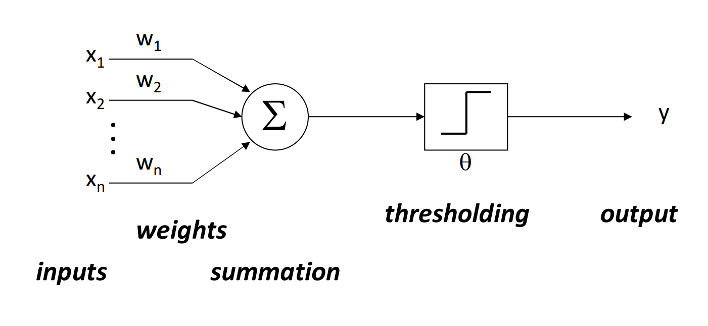

# 感知机 - 神经网络（Preceptrons）
2025-03-05  

  

## 收敛性 (Convergence)  
当训练数据集$y_1$和$y_2$线性可分时，感知机训练算法必定收敛。  

## 强化学习机制 (Reinforcement Learning)  
权重仅在预测错误时更新：  

预测函数：  
$\hat{y} = sign(w \cdot x)$  

## 权重更新公式  
$w \leftarrow w + \alpha y x$  

参数说明：  
- $x$：特征值向量  
- $y$：正确标签  
- $\alpha$：学习率  

## 多类感知机 (Multiclass Perceptrons)  
通过扩展权重向量实现多类别分类的算法：  

### 权重更新规则  
- 类别$y$的权重向量：$w_y$  
- 类别$y$的激活值：$w_y \cdot f(x)$  
- 预测类别：$y = \arg\max_y w_y f(x)$  

更新逻辑：  
- 预测正确：权重不变  
- 预测错误：  
  - 正确类别权重增加：$w_y \leftarrow w_y + f(x)$  
  - 错误类别权重减少：$w_y \leftarrow w_y - f(x)$  
