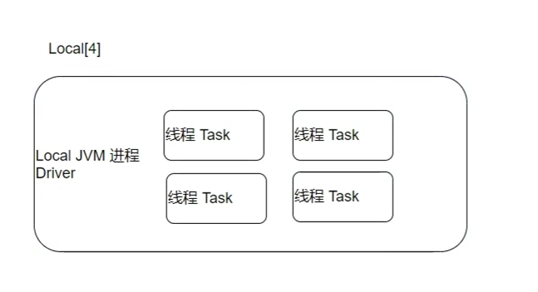

# Spark

Apache Spark, Pyspark

Developed by Berkeley, Algorithms Machines and People Lab

Apache 顶级项目

统一分析引擎，分布式计算

Large scala data unified anaysis 
Resilient Distributed Datasets: A Fault-Tolerant Abstraction for In-Memory CLuster Computing (RDD)

logs.data -> multiple blocks -> one-to-one paritions -> one-to-one tasks

分布式任务分配

Languages: Python, Java, Scala, R, SQL

Spark 3.0, python -> pandas 

Spark vs Hadoop

Hadoop: 基础平台，计算MR，存储HFGS，调度YARN | 海量数据批处理，磁盘迭代计算 | 机器要求低，便宜 | Map + Reduce, API较为底层，算法适应性差 | MapReduce 中间计算在HDFS磁盘上，延迟大 | Task 以进程方式维护，任务启动慢 | 许多计算工具基于MR构架

Spark: 纯计算工具（分布式）| 海量数据批处理，内存迭代计算，交互式计算 | 内存要求高，相对贵 | RDD组成DAG有向无环图， API较为顶层，方便使用 | RDD中间运算结果在内存中，延迟小 | Task以县城方式维护，可批量创建提高并行能力 | 不能完全替换Hadoop，而是融合

Spark: Speed（比Hadoop的MapReduce快100倍，Spark可以把中间处理结果数据储存到内存中，有丰富的API）, Ease of Use（Easy to read）, Generality（Spark SQL，Spark Streaming，MLib，GraphX）, Runs Everywhere (Hadoop, Mesos, Standalone, Kubernetes，数据源：HDFS，HBase，Cassandra，Kafka)

核心模块：Spark Core: Rdd 数据抽象，Python, Java, Scala, R, SQL

SparkSQL：基于SparkCore，提供结构化数据， Interactive
SparkStreaming：流式计算功能
MLib：机器学习计算，大量的机器学词库和API算法，分布式计算
GraphX：图计算，分布式计算

运行模式：
- 本地模式（Local）：独立进程，内部线程来摸摸你整个Spark（Master - Worker） 开发和测试
- Standalone模式（集群）：独立进程，组成Spark集群环境
- Hadoop YARN模式（集群）：个角色运行在YARN的容器内部，组成Spark环境
- Kubernetes模式（容器集群）：Spark的角色运行在Kubernetes容器内部，组成Spark集群环境
- 云服务模式（运行在云平台上）：EMR -> Hadoop -> Spark
(生产环境)

结构（角色）：
Manager（集群的资源管家）（Master）-> Multiple Worker （所在的服务器的资源管理）（Worker） - Driver （Master）-> Executor

Spark 环境搭建 （Local）
三台Linux虚拟机服务器
- node1：Master（HDFS\YARN\Spark）, Worker（HDFS\YARN\Spark）
- node2：Worker（HDFS\YARN\Spark）
- node3：Worker（HDFS\YARN\Spark）， Hive

## Local JVM进程

```bash
--master local[N]
```

N -> Number of Threads（线程数量）
local[*] -> Run Spark locally with as many worker threads as logical cores on your machine

资源管理：Master，Worker
任务执行：Driver，Executor




Citations:
https://www.bilibili.com/video/BV1Jq4y1z7VP?spm_id_from=333.788.videopod.episodes&vd_source=f0f3c9343fe5f087ee05fae9ec07ef38&p=4