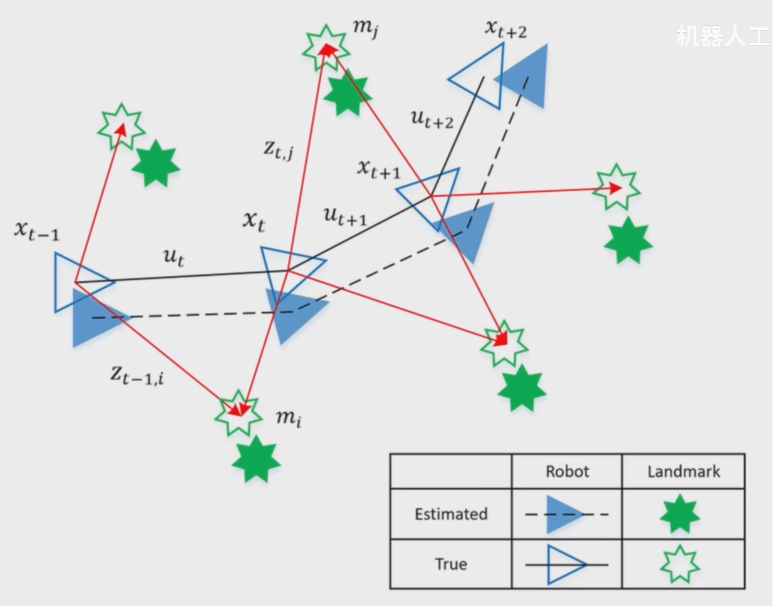

# Simultaneous Localization and Mapping (SLAM)
2025-04-08

## Localization
机器人自我定位

## Mapping
记录参照物的位置（参照物地图）
观测位置 + 共同参照物 + 新的参照物（范围扩展，坐标变换） -> 旋转矩阵
特征地图（参照物地图），start to goal

## 机关扫描


栅格 -> 激光扫描（没有=0，没看=-1，有=100）-> 贴合原来的（栅格排布形状）

## Hector Mapping（ROS）
激光雷达节点 -> 雷达数据话题 /scan -> SLAM 节点（Hector Mapping） -> 地图数据话题 /map -> RViz

ROS Index网站：https://index.ros.org/
Search：hector mapping


## Citation
https://www.bilibili.com/video/BV1FW4y1M7PV/?spm_id_from=333.337.search-card.all.click&vd_source=f0f3c9343fe5f087ee05fae9ec07ef38

### **What is SLAM?**  
**SLAM (Simultaneous Localization and Mapping)** is a computational technique used in robotics, autonomous vehicles, and augmented reality (AR) to **build a map of an unknown environment while simultaneously tracking an agent's location within it**. It’s essential for systems that operate without prior knowledge of their surroundings, such as self-driving cars, drones, and robotic vacuum cleaners.  

---

## **🔍 How SLAM Works**  
SLAM combines data from sensors (e.g., LiDAR, cameras, IMUs) to solve two key problems:  
1. **Mapping**: Creating a model of the environment.  
2. **Localization**: Determining the agent’s position within that map.  

### **Key Steps in SLAM**  
1. **Sensor Data Acquisition**  
   - **LiDAR**: Measures distances to objects.  
   - **Cameras**: Capture visual features (visual SLAM or **vSLAM**).  
   - **IMUs (Inertial Measurement Units)**: Track motion (acceleration, rotation).  

2. **Feature Extraction & Landmark Detection**  
   - Identify stable landmarks (e.g., corners, edges) for tracking.  

3. **Pose Estimation**  
   - Predict the agent’s position using sensor fusion (e.g., Kalman filters, particle filters).  

4. **Map Optimization**  
   - Adjust the map to reduce errors (e.g., using **GraphSLAM** or **Bundle Adjustment**).  

5. **Loop Closure**  
   - Detect revisited locations to correct drift errors.  

  

---

## **🚀 Types of SLAM**  
| Type | Sensors Used | Applications |  
|------|-------------|--------------|  
| **LiDAR SLAM** | LiDAR | Autonomous cars, drones |  
| **Visual SLAM (vSLAM)** | Cameras | AR/VR, robotics |  
| **Visual-Inertial SLAM** | Cameras + IMU | Smartphones (e.g., ARKit, ARCore) |  
| **RGB-D SLAM** | Depth cameras (Kinect) | Indoor robotics |  

---

## **💡 Why SLAM Matters**  
✅ **Autonomy**: Enables robots/navigational systems to operate without GPS.  
✅ **Precision**: Critical for tasks like surgical robotics or warehouse automation.  
✅ **Adaptability**: Works in dynamic environments (e.g., crowded streets).  

---

## **🛠️ Popular SLAM Algorithms**  
1. **ORB-SLAM** (Visual SLAM)  
   - Uses ORB features for real-time tracking.  
2. **LOAM (LiDAR Odometry and Mapping)**  
   - High-precision LiDAR-based SLAM.  
3. **RTAB-Map**  
   - Supports RGB-D cameras for 3D mapping.  
4. **Google Cartographer**  
   - Combines LiDAR and IMU data for 2D/3D mapping.  

---

## **📌 Challenges in SLAM**  
❌ **Computational Complexity**: Real-time processing is resource-intensive.  
❌ **Dynamic Environments**: Moving objects (e.g., people) can confuse the system.  
❌ **Drift Errors**: Accumulated over time without loop closure.  

---

## **🌐 Applications of SLAM**  
1. **Self-Driving Cars** (Tesla, Waymo)  
2. **Drones** (Autonomous navigation)  
3. **Augmented Reality** (Pokémon GO, Apple ARKit)  
4. **Robotic Vacuum Cleaners** (Roomba)  
5. **Space Exploration** (NASA Mars rovers)  

---

### **Example Code (Python + ROS for SLAM)**  
```python  
# Using ROS with Gmapping (LiDAR SLAM)  
roslaunch turtlebot3_slam turtlebot3_slam.launch slam_methods:=gmapping  
```  

---

**Want to dive deeper?** Ask about:  
- Implementing SLAM with **Python/ROS**  
- **Visual SLAM vs. LiDAR SLAM** trade-offs  
- **SLAM for drones/robots** tutorials  

Let me know your focus area! 🚀