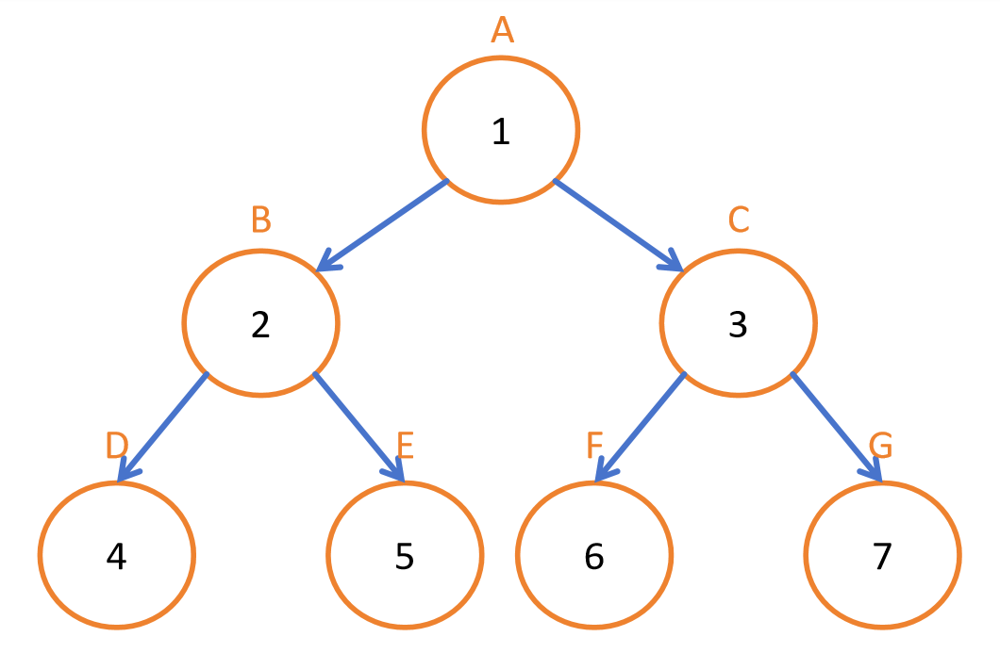
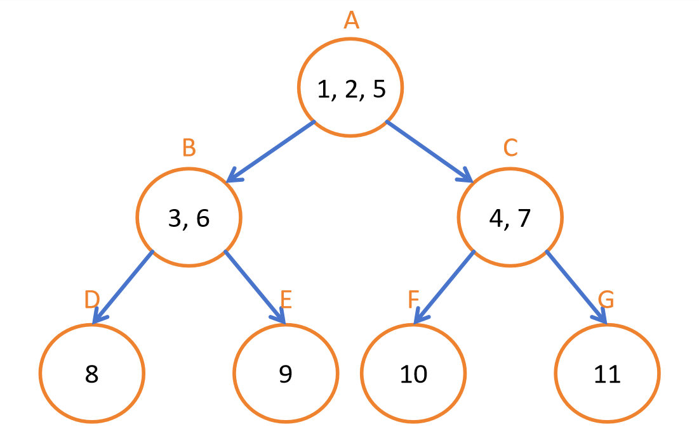

# Heuristics and A* Search  
2025-01-13  

## State Space  
The state space represents all possible states that can be encountered while solving a problem. It defines the full set of configurations a system can take during the search process.  

## Operator Preconditions  
Operator preconditions refer to the necessary conditions that a state must satisfy before a specific operation can be applied. These constraints ensure that transitions between states follow logical rules and maintain problem consistency.  

A search can be performed on either a search tree or a graph.  

## Search Trees  
A search tree is a data structure that represents the paths an algorithm explores to find a solution. Nodes correspond to states, while edges represent transitions between states based on available operations.  

## Graph Search  
Graph search expands upon search trees by accounting for repeated states and cycles. It ensures that visited nodes are tracked to avoid redundant computations, improving efficiency in large or cyclic state spaces.  

## OPEN list
Store the nodes found by expanding the current node.

## CLOSE list
Where nodes already searched are stored.

## Depth-First Search (DFS)  
DFS prioritizes depth over breadth, making it useful for exploring deep solution spaces. 

Pros:  
- Requires less memory compared to BFS. (Shorter OPEN list) 
- Can be useful when searching for solutions in deep state spaces.  

Cons:  
- May get stuck in cycles if there are loops.
- Does not guarantee finding the shortest path in graph search.

  

## Breadth-First Search (BFS)  
BFS explores all nodes at the current depth level before moving deeper. It guarantees the shortest path in unweighted graphs but can be memory-intensive due to its need to store all explored states.  

Pros:  
- Guarantees the shortest path in an unweighted graph.  

Cons:  
- High memory usage due to storing all nodes at the current level.  
- Can be slow for deep search spaces.  

  

## Iterative Deepening Depth-First Search (IDDFS)  
IDDFS combines the space efficiency of DFS with the completeness of BFS. It repeatedly performs DFS with limited depth, gradually increasing the depth limit until a solution is found.  

Pros:  
- Less memory usage since fewer nodes are stored in the open list.  
- Guarantees finding the shortest path in an unweighted graph.  

Cons:  
- Re-expands nodes multiple times, leading to increased runtime, though it has the same time complexity as BFS.

  

## Combinatorial Explosion  
Combinatorial explosion refers to the exponential growth of possible states as problem complexity increases. This phenomenon makes exhaustive search methods impractical for large problems, which necessitates heuristic approaches.  

## Heuristics  
To minimize the number of nodes expanded, heuristics are used when prior knowledge about the problem is available.  

Heuristics are problem-specific functions that estimate the cost of reaching a goal from a given state. They guide search algorithms like A* to focus on promising paths, reducing unnecessary exploration and improving efficiency.

However, the determiniation of Heuristics is tricky because for a heuristic to work it often require proior knowledge of which path is the shortest path, which that is what search algoirthms are supposed to find out.

### Admissible Heuristic  
An admissible heuristic never overestimates the actual cost to reach the goal. This ensures that A* search remains optimal.

The equation for an admissible heuristic is:

\[
h(s) \leq d(s, G)
\]

Where \( h(s) \) is the heuristic value at state \( s \) and \( d(s, G) \) is the true distance from state \( s \) to the goal state \( G \).

#### Admissible Heuristic Table Example:

| Node | A | B | C |
|-------------------|-------------------------------------|--------------------------|--------------------------------------|
| Heuristic $h(s)$ | 1 | 2 | 3 |
| True distance from goal state \( d(s, G) \) | 2 | 2 | 4 |         |

The heuristic value \( h(s) \) never overestimates the true cost \( d(s, G) \), fulfilling the admissibility condition.

---

### Consistent Heuristic  
A heuristic is consistent if, for every node \( n \) and its successor \( n' \), the estimated cost from \( n \) to the goal is never greater than the estimated cost from \( n' \) plus the cost of reaching \( n' \). This ensures that A* search does not need to revisit nodes.

The equation for a consistent heuristic is:

\[
h(n) \leq d(n, n') + h(n')
\]

Where:
- \( h(n) \) is the heuristic value at node \( n \),
- \( d(n, n') \) is the true cost from node \( n \) to its successor \( n' \),
- \( h(n') \) is the heuristic value at successor \( n' \).

#### Consistent Heuristic Table Example:

| Node \( n \) | Successor \( n' \) | True Cost \( d(n, n') \) | Heuristic \( h(n) \) | Heuristic \( h(n') \) | Condition \( h(n) \leq d(n, n') + h(n') \) |
|------------------|------------------------|------------------------------|--------------------------|---------------------------|----------------------------------------------|
| A                | B                      | 2                            | 8                        | 6                         | Yes                                          |
| B                | C                      | 3                            | 6                        | 3                         | Yes                                          |
| C                | D                      | 1                            | 3                        | 10                        | Yes                                          |
| D                | E                      | 2                            | 10                       | 9                         | Yes                                          |
| E                | F                      | 4                            | 9                        | 4                         | Yes                                          |

This table demonstrates that for each pair of nodes and their successors, the heuristic at node \( n \) is always less than or equal to the true cost from \( n \) to \( n' \) plus the heuristic at \( n' \), fulfilling the consistency condition.

## A* Search  
A* (A-star) search is an informed search algorithm that balances path cost and heuristic estimates to efficiently find optimal solutions. It employs a priority queue to expand the most promising nodes first, significantly improving search performance.  

Pros:  
- Guarantees an optimal solution when using an admissible and consistent heuristic.  
- More efficient than uninformed search algorithms like BFS and DFS.  

Cons:  
- Performance heavily depends on the quality of the heuristic.  
- Can be memory-intensive in large search spaces.  