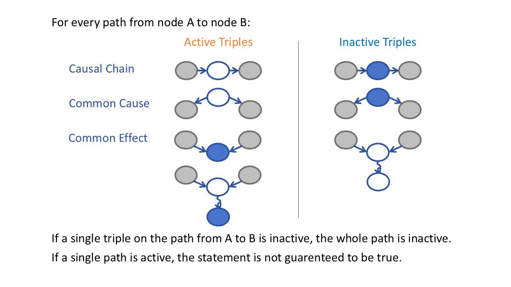

# D-Seperation
2025-02-25

## Definition and Use
D-seperation is used in Bayes Nets. In a system with multiple random variables, we want to know the conditionally independent of event A and B given the condition that other variables are observed.

Example:

- Medical Scenario: Relationships (causes, effects) between diseases and symptoms.

"Given a Bayes Net and a subset of nodes (C, D) that are observed, is it guarrenteed that (A) and (B) are conditionally independent of each other."

A ⊥ B | C, D

