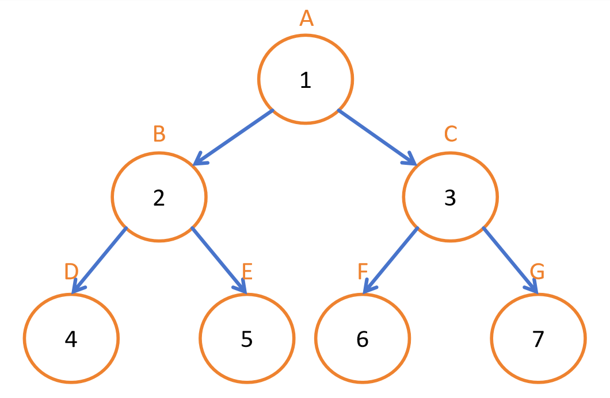

# 启发式搜索与A星算法 (Heuristics and A-Star Search)
2025-01-13  

## 状态空间 (State Space)  
状态空间表示解决问题时可能遇到的所有可能状态，定义了搜索过程中系统可以采取的全部配置集合。

## 操作符前提条件 (Operator Preconditions)  
操作符前提条件指在应用特定操作前，状态必须满足的必要条件。这些约束确保状态转换遵循逻辑规则并保持问题一致性。

搜索可以在搜索树或图上进行。

## 搜索树 (Search Trees)  
搜索树是表示算法探索路径以寻找解决方案的数据结构。节点对应状态，边表示基于可用操作的状态转换。

## 图搜索 (Graph Search)  
图搜索通过考虑重复状态和循环扩展了搜索树的概念。它跟踪已访问节点以避免冗余计算，提高了大型或循环状态空间的效率。

## OPEN表 (OPEN list)  
存储通过扩展当前节点发现的新节点。

## CLOSE表 (CLOSE list)  
存储已完成搜索的节点。

## 深度优先搜索 (DFS - Depth-First Search)  
DFS优先探索深度而非广度，适用于深度解空间的探索。

优点：
- 相比BFS内存需求更低（OPEN表更短）
- 适用于深度状态空间的搜索

缺点：
- 存在循环时可能陷入无限循环
- 不保证在图搜索中找到最短路径

## 广度优先搜索 (BFS - Breadth-First Search)  
BFS在深入下一层前先探索当前深度的所有节点。在无权图中保证找到最短路径，但需要存储所有探索过的状态，内存消耗较大。

优点：
- 在无权图中保证找到最短路径

缺点：
- 需要存储当前层的所有节点，内存使用高
- 对深度搜索空间效率较低

## 迭代加深深度优先搜索 (IDDFS - Iterative Deepening DFS)  
IDDFS结合了DFS的空间效率和BFS的完备性。它通过逐步增加深度限制重复执行DFS，直到找到解。

优点：
- 内存使用较少（OPEN表中节点更少）
- 在无权图中保证找到最短路径

缺点：
- 需要多次重新扩展节点，导致运行时间增加（但时间复杂度与BFS相同）

## 组合爆炸 (Combinatorial Explosion)  
组合爆炸指随着问题复杂度增加，可能状态数呈指数级增长的现象。这使得穷举搜索方法对大规模问题不切实际，需要启发式方法。

## 启发式 (Heuristics)  
当具备问题的先验知识时，可使用启发式函数来最小化需要扩展的节点数。

启发式是特定于问题的函数，用于估计从给定状态到目标的代价。它引导A*等搜索算法聚焦有希望的路径，减少不必要的探索，提高效率。

然而确定合适的启发式具有挑战性，因为有效的启发式通常需要预先知道哪条路径最短——而这正是搜索算法需要解决的问题。

### 可采纳启发式 (Admissible Heuristic)  
可采纳启发式永远不会高估到达目标的实际代价，这保证了A*搜索的最优性。

可采纳启发式的数学表达式：
\[
h(s) \leq d(s, G)
\]

其中$h(s)$是状态$s$的启发值，$d(s,G)$是从状态$s$到目标状态$G$的真实距离。

#### 可采纳启发式表示例：

| 节点 | A | B | C |
|------|---|---|---|
| 启发值$h(s)$ | 1 | 2 | 3 |
| 真实距离$d(s,G)$ | 2 | 2 | 4 |

启发值$h(s)$从未高估真实代价$d(s,G)$，满足可采纳性条件。

### 一致启发式 (Consistent Heuristic)  
如果对每个节点$n$及其后继$n'$，从$n$到目标的估计代价总是不大于从$n'$的估计代价加上到达$n'$的代价，则该启发式是一致的。这确保A*搜索不需要重新访问节点。

一致启发式的数学表达式：
\[
h(n) \leq d(n, n') + h(n')
\]

## A*搜索 (A* Search)  
A*搜索是一种启发式搜索算法，通过平衡路径代价和启发式估计来高效寻找最优解。它使用优先队列优先扩展最有希望的节点，显著提高搜索性能。

优点：
- 使用可采纳且一致的启发式时保证找到最优解
- 比BFS和DFS等无信息搜索算法更高效

缺点：
- 性能高度依赖启发式质量
- 在大规模搜索空间中可能内存消耗较大