# 动力系统与混沌学习笔记  
2025-03-14  

## 动力系统  
**动力系统**是描述状态变量随时间演化规律的一组规则。  

## 一维系统  

### 分类  
- **自治系统**：方程右边（RHS）不显含时间$t$  
- **线性系统**：系统关于$x$呈线性关系  

### 不动点  
满足以下条件的点称为不动点：  

$$
\dot{x} = 0  
$$  

- **相空间（状态空间）**：表示动力系统所有可能状态的空间  

#### 不动点稳定性判据  
1. **稳定** - $f(x*)' \lt 0$  
2. **渐近稳定**  
3. **不稳定** - $f(x*)' \gt 0$  
4. **无法判定** - $f(x*)' = 0$  

- **相图**：展示相空间中系统轨迹的示意图  
  - 在$x$轴上方时，质点向左移动  
  - 在$x$轴下方时，质点向右移动  

- **定性分析图**：  
  - 不动点用虚线表示  
  - 稳定点吸引轨迹  
  - 不稳定点排斥轨迹  

- **非自治/显含时间方程** $\dot{x} = f(x,t)$ 需视为二维或二阶系统处理  

- **全局稳定**：系统从所有初始条件都趋向该不动点  
- **局部稳定**：稳定性取决于初始条件  

### 逻辑斯蒂方程  
**逻辑斯蒂方程**描述了存在限制因素的人口增长模型。  

### 稳定性判据的替代方法  
考虑系统：  

$$
\dot{x} = f(x), \quad x^* = 0  
$$  

在$x^*$处施加扰动：  

$$
x(t) = x^* + \epsilon(t)  
$$  

其中$\epsilon(t)$表示微小扰动。通过**泰勒展开**：  

$$
f(x) = f(x^*) + \epsilon(t) f'(x^*) + \frac{\epsilon(t)^2}{2} f''(x^*)  
$$  

求解微分方程：  

$$
\dot{\epsilon} = \epsilon f'(x^*)  
$$  

得到解：  

$$
\epsilon(t) = \epsilon(0) e^{f'(x^*)t}  
$$  

若$f'(x^*) \lt 0$，扰动衰减，系统稳定。  

### 解的存在唯一性定理  
对于初值问题：  

$$
\dot{x} = f(x), \quad x(0) = x_0  
$$  

若$f(x)$和$f'(x)$在$x$轴的某个开区间$R$上**连续**，且$x_0 \in R$，则在$t=0$的某个邻域$(-\tau, \tau)$内存在唯一解$x(t)$。  

### 振荡的不可能性  
$\dot{x} = f(x)$的解**不可能出现振荡**。实线上向量场只有两种可能：  
1. 收敛至不动点  
2. 发散至$\pm \infty$  

## 一维系统的分岔  
当不动点的稳定性依赖于某个参数时，会发生分岔现象。  

**分岔点**：稳定性发生改变的临界点  

分析步骤：  
1. 求不动点  
2. 计算判别式$b^2-4ac=0$确定临界参数$r_c$  

### 鞍结分岔  
**鞍结分岔**指两个不动点产生或湮灭的现象。  

- **标准形式**：  

$$
  \dot{x} = L + x^2  
$$  

- 在分岔点$(x^*, L_c)$附近满足：  

$$
  f(x, L) = 0, \quad f'(x) = 0  
$$  

分岔点处通常存在一个**半稳定**不动点。  

**分岔图示例**：  

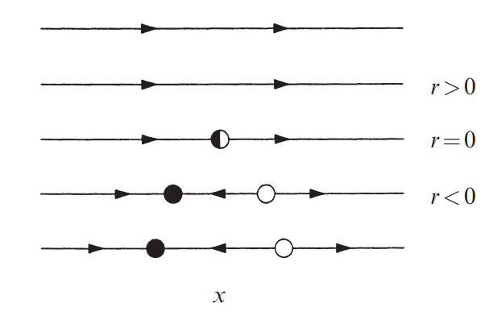  

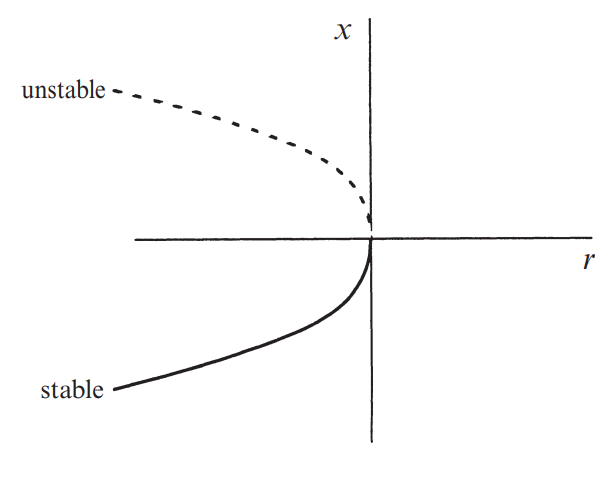  

**技巧**：若求解$f(x) = 0$困难，可采用**图像交点法**：  
- 交点对应不动点  
- 稳定性判断：  
  - 当$f_2(x) \gt f_1(x)$时向左移动  
  - 当$f_1(x) \gt f_2(x)$时向右移动

### 跨临界分岔  
- **标准形式**：  

$$
  \dot{x} = Lx - x^2, \quad L \in \mathbb{R}  
$$  

- **不动点**：  

$$
  x^* = 0, \quad x^* = L  
$$  

**分岔图**：  

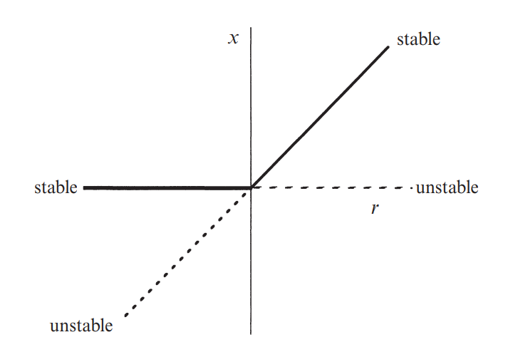  

在跨临界分岔中，两个不动点**不会消失**，而是**交换稳定性**。  

### 叉式分岔  

#### 超临界叉式分岔  
- **标准形式**：  

$$
  \dot{x} = Lx - x^3  
$$  

- **不动点**：  

$$
  x^* = 0, \quad x^* = \pm \sqrt{L}, \quad L \gt 0  
$$  

- $x^* = 0$ 在 $L \lt 0$ 时**稳定**，但在 $L \gt 0$ 时**不稳定**，此时会涌现两个**稳定**不动点。  

**分岔图**：  

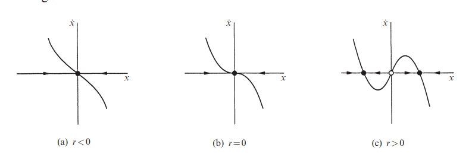  

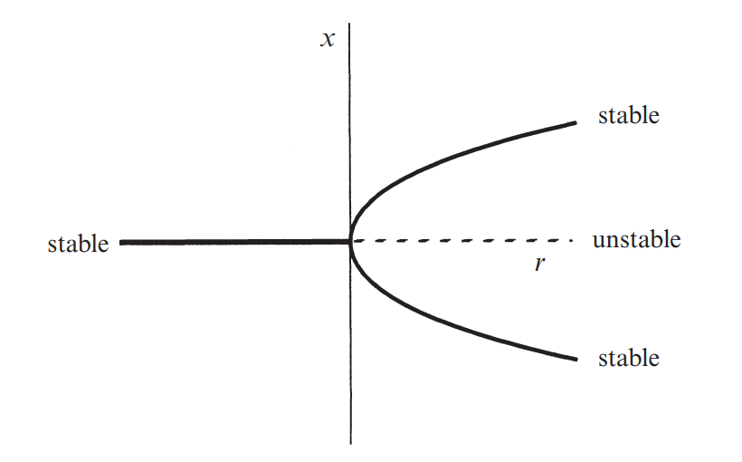  

#### 亚临界叉式分岔  
- **标准形式**：  

$$
  \dot{x} = Lx + x^3  
$$  

- **不动点**：  

$$
  x^* = 0, \quad x^* = \pm \sqrt{-L}, \quad L \gt 0  
$$  

- $x^* = 0$ 在 $L \gt 0$ 时**稳定**，但在 $L \lt 0$ 时**不稳定**，此时两个**不稳定**不动点会消失。  

**分岔图**：  

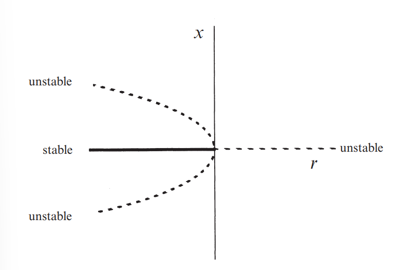  

## 无量纲化  

$$x = \frac{u}{v}, \quad \tau = \frac{t}{T}$$  

$$u = xU \quad \Rightarrow \quad \frac{du}{dt} = \frac{d}{dt}(xU) = U\frac{dx}{d\tau} \frac{d\tau}{dt} = \frac{U}{T} \frac{dx}{d\tau}$$  

## 圆周相空间  

描述振荡系统的基本模型：  

$$\dot{\theta} = f(\theta)$$  

圆周 $S_L$ 上的向量场：  

$$\theta \in [0, L) = S_L$$  

示例：  

$$\dot{\theta} = \sin{\theta}, \quad \theta \in S_{2\pi} = [0, 2\pi)$$  

不动点：  

$$\sin{\theta} = 0 \Rightarrow \theta = n\pi, \quad n \in \mathbb{N} \Rightarrow \theta^* = 0 \text{ 和 } \theta^* = \pi$$  

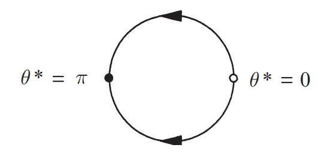  

圆周上的点称为**角度**或**相位**。  

### 均匀振子  

$\theta$ 均匀变化：  

$$\dot{\theta} = \omega$$  

解：  

$$\theta(t) = \omega t + \theta_0, \quad \theta_0 \text{ 为初始角度。}$$  

振荡周期：  

$$T = \frac{2\pi}{\omega}$$  

### 非均匀振子  

$$\dot{\theta} = \omega - \alpha \sin \theta$$  

不动点：  

$$\omega = \alpha \sin \theta$$  

- 若 $\alpha \lt \omega$，无不动点。  
- 若 $\alpha = \omega$，在 $\theta^* = \frac{\pi}{2}$ 处存在半稳定不动点。  
- 若 $\alpha \gt \omega$，存在两个不动点（一稳定，一不稳定）。  

求解周期：  

$$\int_0^{2\pi} \frac{d\theta}{\omega - \alpha \sin \theta} = \int_0^T dt \Rightarrow \theta = 2 \arctan \omega, \quad T = \frac{2\pi}{\sqrt{\omega^2 - \alpha^2}}$$  

结论：当 $\alpha = \omega$ 时，在 $\theta^* = \frac{\pi}{2}$ 处发生**鞍结分岔**。

## 二维线性系统  

$$\dot{x} = ax + by, \quad \dot{y} = cx + dy$$  

### 矩阵形式  

$$\dot{\mathbf{x}} = A\mathbf{x}$$  

$$A = \begin{pmatrix} a & b \\ c & d \end{pmatrix}, \quad \mathbf{x} = \begin{pmatrix} x \\ y \end{pmatrix}$$  

当$\dot{\mathbf{x}} = 0$时出现不动点（对任意矩阵$A$均成立）。  

解可视为$(x,y)$平面上的运动轨迹（相平面上的向量场）。  

### 向量场绘制  
分析：  
- 当$y=0$时，考察$(\dot{x}, \dot{y})$  
- 当$x=0$时，考察$(\dot{x}, \dot{y})$  

### 相图  
通过积分$\frac{\dot{x}}{\dot{y}}$获得相图。  

### 稳定流形  
初始条件集$\begin{pmatrix} x_0 \\ y_0 \end{pmatrix}$满足：当$t \to \infty$时$\mathbf{x}(t) \to \mathbf{x}^*$。  

### 不稳定流形  
初始条件集$\begin{pmatrix} x_0 \\ y_0 \end{pmatrix}$满足：当$t \to -\infty$时$\mathbf{x}(t) \to \mathbf{x}^*$。  

### 分类  
假设$\dot{\mathbf{x}} = A\mathbf{x}$，设解形式为：  

$$\mathbf{x}(t) = e^{\lambda t} \mathbf{v}$$  

求解特征方程：  

$$\lambda \mathbf{v} = A \mathbf{v}$$  

计算特征值：  

$$\begin{vmatrix} a - \lambda & b \\ c & d - \lambda \end{vmatrix}$$  

定义：  
$$\tau = \text{迹}(A) = a + d$$  
$$\Delta = \det(A) = ad - bc$$  

特征值表达式：  

$$\lambda_1 = \frac{\tau + \sqrt{\tau^2 - 4\Delta}}{2}, \quad \lambda_2 = \frac{\tau - \sqrt{\tau^2 - 4\Delta}}{2}$$  

通解形式：  

$$\mathbf{x}(t) = c_1 e^{\lambda_1 t} \mathbf{v}_1 + c_2 e^{\lambda_2 t} \mathbf{v}_2$$  

- **较大特征值**：快特征方向  
- **较小特征值**：慢特征方向  

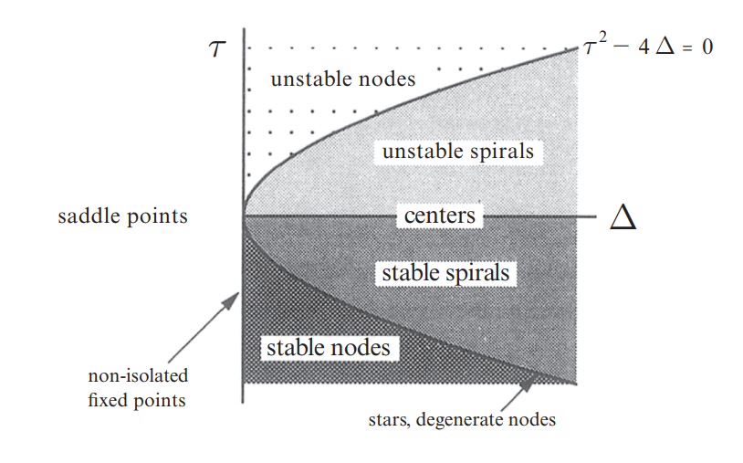  

### 稳定性判据  
- 若$\Delta \lt 0$：特征值异号 → **鞍点**  
- 若$\Delta \gt 0$：  
  - 实特征值同号 → **结点**  
  - 复共轭特征值 → **焦点或中心**  
- 细化分类：  
  - 结点：$\tau^2 - 4\Delta \gt 0$  
  - 焦点：$\tau^2 - 4\Delta \lt 0$  
  - 退化结点与星形结点：$\tau^2 - 4\Delta = 0$  
  - $\tau \lt 0$：特征值实部为负 → **稳定**  
  - $\tau \gt 0$：**不稳定**  
  - $\tau = 0$：纯虚特征值 → **中性稳定**  
- 若$\Delta = 0$：至少一个零特征值 → **存在整条直线/平面的不动点**  

## 二维非线性系统  

$$
\dot{x_1} = f_1(x_1, x_2)  
$$  

$$
\dot{x_2} = f_2(x_1, x_2)  
$$  

### 向量表示  

$$
\vec{x} = \vec{f}(\vec{x})  
$$  

$$
\vec{x} =
\begin{pmatrix}
x_1 \\
x_2
\end{pmatrix},  
\quad  
\vec{f}(\vec{x}) =
\begin{pmatrix}
f_1(x_1, x_2) \\
f_2(x_1, x_2)
\end{pmatrix}
$$  

对于非线性系统，解析解通常难以获得。我们转而通过分析$\vec{f}(\vec{x})$的性质来研究解的定性行为。  

### 存在唯一性定理（n维系统）  
若$\vec{f}(\vec{x})$在连通开集$D \subset \mathbb{R}^n$内连续且所有偏导数连续，则对任意$\vec{x_0} \in D$，初值问题在$t=0$的某区间$(-\tau, \tau)$内存在唯一解$\vec{x}(t)$。

- 由唯一性可知，不同轨迹永不相交。

### 线性化技术——近似相图  
**不动点**：当$\dot{x} = 0$和$\dot{y} = 0$同时满足时出现。

#### 雅可比矩阵  
$$
A =
\begin{bmatrix}
\frac{\partial f_1}{\partial x_1} & \frac{\partial f_1}{\partial x_2} \\
\frac{\partial f_2}{\partial x_1} & \frac{\partial f_2}{\partial x_2}
\end{bmatrix}
$$

在不动点处计算$A$可判定稳定性：

- **排斥子（源点）**：特征值实部均为正  
- **吸引子（汇点）**：特征值实部均为负  
- **鞍点**：特征值一正一负  
- **中心点**：特征值为纯虚数（$\text{Re}(\lambda) = 0$）  
- **高阶与非孤立不动点**：至少一个特征值为0（$\text{Re}(\lambda) = 0$）  

**稳定性条件**：  
- **不稳定**：任一特征值实部为正  
- **稳定**：所有特征值实部为负  

## 保守系统  
$$
E(x) = \frac{1}{2} m \dot{x}^2 + V(x)
$$

**守恒量**：$E$随时间保持恒定  
$$
\frac{dE}{dt} = 0
$$

- 保守系统不可能存在吸引性不动点  
- **分界线**：将相图划分为不同行为区域  
- **异宿轨道**：连接不同不动点的轨迹  
- **同宿轨道**：起始并终止于同一不动点的轨迹  

## 极限环  
**孤立闭合轨迹**，邻近轨迹要么向其螺旋靠近，要么远离。

- **稳定（吸引）**：所有邻近轨迹趋近极限环，可模拟自持振荡  
- **闭合轨道**：必须环绕不动点，且区域$R$（平面的有界闭子集）内不允许存在不动点  

## 梯度系统  
$$
\dot{\vec{x}} = -\nabla V
$$

其中$V$为势函数，  
$$
\nabla V = \left( \frac{\partial V}{\partial x}, \frac{\partial V}{\partial y} \right)
$$

$$
\dot{x} = -\frac{\partial V}{\partial x}, \quad \dot{y} = -\frac{\partial V}{\partial y}
$$

1. **梯度系统条件**：若$\frac{\partial V}{\partial x} = \frac{\partial V}{\partial y}$，则为梯度系统  
2. **计算$V$**：  
$$
-V = \int \frac{\partial V}{\partial x} \,dx + g(y)
$$
$$
-\frac{\partial V}{\partial y} = -\frac{\partial V}{\partial y} + g'(y)
$$
$$
g(y) = \int g'(y) \,dy, \quad C = 0
$$

### 本迪克松定理  
若区域$D \subset \mathbb{R}^2$无洞且  
$$
\frac{\partial f}{\partial x} + \frac{\partial g}{\partial y} \neq 0
$$
在$D$内不变号，则系统  
$$
\dot{x} = f(x, y), \quad \dot{y} = g(x, y)
$$
在$D$内**不存在闭合轨迹**。

### 李雅普诺夫函数  
考虑$\dot{\vec{x}} = \vec{f}(\vec{x})$及其不动点$\vec{x}^*$。若存在连续可微实值函数$V(\vec{x})$满足：  
1. 对所有$\vec{x} \neq \vec{x}^*$有$V(\vec{x}) \gt 0$且$V(\vec{x}^*) = 0$  
2. 对所有$\vec{x} \neq \vec{x}^*$有$\dot{V}(\vec{x}) \lt 0$  

则该系统**不存在闭合轨道**。

### 杜拉克判据  
对于单连通区域$R$上定义的$\dot{\vec{x}} = \vec{f}(\vec{x})$，若存在连续可微实值函数$g(\vec{x})$使得  
$$
D \cdot (f(\dot{\vec{x}}))
$$
在$R$内定号，则**$R$内不存在闭合轨道**。

### 庞加莱-本迪克松定理  
给定条件：  
1. $R$是平面的有界闭子集  
2. $\dot{\vec{x}} = \vec{f}(\vec{x})$在包含$R$的开集上连续可微  
3. $R$内无不动点  
4. 轨迹$C$被限制在$R$内（初始于$R$并永远保持在$R$中）  

则$C$要么是**闭合轨道**，要么随$t \to \infty$**螺旋趋近于闭合轨道**。

**推论**：二维自治系统不会出现**混沌**。

## 弱非线性振子 (Weakly Nonlinear Oscillators)  

$$
x'' + x + \epsilon h(x, x') = 0
$$

我们限制$\epsilon$为小参数以分析可能的**极限环 (limit cycles)**。

- **示例**：范德波尔振子 (van der Pol oscillator)：  

$$
  x'' + x + \epsilon (x^2 - 1)x' = 0
$$

### 常规摄动理论 (Regular Perturbation Theory)  

假设级数展开：  

$$
x = x_0(t) + \epsilon x_1(t) + \epsilon^2 x_2(t) + \dots
$$

$$
x' = x_0'(t) + \epsilon x_1'(t) + \epsilon^2 x_2'(t) + \dots
$$

按$\epsilon$的幂次分组：

- $O(\epsilon^0)$ = 不含$\epsilon$的项  
- $O(\epsilon^1)$ = 含单个$\epsilon$的项  

**关键条件**：初始条件必须对所有充分小的$\epsilon$有效，以避免$t \to \infty$时解无界增长。

$$
x(t, \epsilon) = solution(\epsilon^0) + \epsilon \, solution(\epsilon^1) + O(\epsilon^2)
$$  

## 二维系统的分岔 (Bifurcations in 2D Systems)  

通过计算雅可比矩阵并按情况分类来分析分岔。

### 零特征值分岔 (Zero-Eigenvalue Bifurcations)  

- **鞍结分岔 (Saddle-Node Bifurcation)**：不动点碰撞合并  
- **跨临界分岔 (Transcritical Bifurcation)**：不动点稳定性交换  
- **叉式分岔 (Pitchfork Bifurcation)**：单个稳定不动点转变为不稳定  
- **超临界叉式分岔 (Supercritical Pitchfork Bifurcation)**：单个稳定不动点分裂为两个稳定不动点  

### 霍普夫分岔 (Hopf Bifurcations)  

#### 超临界霍普夫分岔 (Supercritical Hopf Bifurcation)  

设$a$为系统参数，$a_c$表示分岔临界值：  

1. 当$a \lt a_c$时：存在稳定焦点，整个相平面被吸引至不动点  
2. 当$a \gt a_c$时：不动点变为不稳定焦点。由于分岔是局部现象，远离不动点的动力学仍保持不变。远处轨迹向内运动，而近处轨迹向外运动，形成极限环  

此类分岔称为**超临界霍普夫分岔**，因为当$a \gt a_c$时会出现极限环。

#### 亚临界霍普夫分岔 (Subcritical Hopf Bifurcation)  

亚临界情况更为剧烈：分岔后轨迹会跳跃至远处的吸引子，可能是另一个不动点、极限环、无穷远，或在三维及以上系统中出现混沌吸引子 (chaotic attractor)。  

## 离散动力系统 (Discrete Dynamical Systems)  

### 差分方程系统 (Difference Equation Systems)  

离散系统定义为：  

$$x_{n+1} = f(x_n, n)$$  

其中**n**是时间类变量。  

解不是连续函数而是以**n**为索引的序列：  
$$(x_0, x_1, ... x_n)$$  

#### 不动点 (Fixed Points)  

满足迭代不变化的点：  

$$x_{n+1} = x_n \Rightarrow x_n = f(x_n)$$  

不动点满足：  

$$x^* = f(x^*)$$  

#### 稳定性 (Stability)  

对线性化系统：  

$$x_{n+1} = \lambda x_n$$  

解的形式为：  

$$x_n = \lambda^n x_0$$  

不动点满足：  

$$x^* = \lambda x^* \Rightarrow x^* (\lambda -1) = 0$$  

- **若**$|\lambda| \lt 1$，则$x_n$收敛至0（稳定）  
- **若**$|\lambda| \gt 1$，则$\lambda^n$随$n$增大无界增长（不稳定）  
- **若**$|\lambda| = 1$，线性稳定性分析无法判定  

### 蛛网图 (Cobweb Diagram)  

对映射$x_{n+1} = f(x_n)$的图形迭代：  

1. 从$x_0$画至$f(x_n)$  
2. 水平画至$x_1$  
3. 垂直画至$f(x_n)$  
4. 重复上述步骤  

### 周期轨道 (Periodic Orbits)  

周期为**N**的轨道满足：  

$$x_N = x_0$$  

$$x = f^N(x) = f(f(f(...(x))))$$  

**周期2轨道 (Period-2 Orbit Cycle)**：  

$$x_{n+1} = x_{n+2}$$  

$$x_{n+2} = x_{n+1}$$  

**倍周期分岔 (Period-Doubling Bifurcation)**：  
新2-周期轨道在分岔值**r**处出现。  

## 混沌 (Chaos)  

**Strogatz定义**：混沌是确定性系统中表现出的对初始条件敏感依赖的非周期长期行为。  

**Decominck定义**：若动力学在紧集上对初始条件敏感且具有传递性（即轨道可无限接近集合中每一点），则该紧集上的动力学是混沌的。  

### 单峰映射 (Unimodal Map)  

若映射$f(x)$在$[0,1] \rightarrow [0,1]$上光滑、下凹且具有单峰，则称为**单峰映射**。  

- 若$x_{n+1} = f(x_n)$存在**不稳定周期3轨道 (unstable period-3 orbit)**，则该映射具有任意整数周期的不稳定周期轨道，此时差分方程是混沌的。

## 分形 (Fractals)

### 自相似性 (Self-Similarity)
自相似性指在不同放大尺度下都能观察到原始结构的重复特性。

### 可数性 (Countability)
若无限集合中的元素能与自然数建立一一对应关系，则该集合可数 (countable)，否则不可数 (uncountable)。

## 康托尔集 (Cantor Sets)

1. 绘制线段[0,1]
2. 移除中间三分之一区间
3. 无限重复此过程——该过程的极限即为康托尔集C

**康托尔集特性**：
- 不可数 (uncountable)
- 自相似 (self-similar)
- 勒贝格测度 (Lebesgue measure) 为0

数学表达式：
$$\sum^{\infty}_{n=0} 2^n \frac{1}{3^{n+1}}$$
其中$2^n$表示移除的线段数量，$\frac{1}{3^{n+1}}$表示剩余每段的长度。

**几何级数公式**：
$$S_n = \sum^{\infty}_{n=0} a_n r^n = \frac{a_1}{1 - r}$$

## 维度 (Dimension)

### 相似维度 (Similarity Dimension)
对于自相似集，相似维度$d$由下式给出：
$$d = \frac{\ln{M}}{\ln{R}}$$
其中：
- $M$为相同副本数量
- $R$为缩放因子

### 盒计数维度 (Box-Counting Dimension)
适用于非自相似分形：
$$
d = \lim_{\epsilon \rightarrow 0} \frac{\ln N(\epsilon)}{\ln \frac{1}{\epsilon}}
$$

## 奇怪吸引子 (Strange Attractors)

### 李雅普诺夫指数 (Lyapunov Exponents)
描述无限接近轨迹的分离速率：
$$
|\delta(t)| \approx e^{\lambda t}|\delta(0)|
$$

### 拉伸与折叠 (Stretching and Folding)
面包师映射 (Baker's Map) 当$a\gt \frac{1}{2}$时：
吸引子A可近似为$B^n(S)$，包含$2^n$个高度为$a^n$、长度为1的带状区域。

用边长为$\epsilon = a^n$的方盒覆盖A：
所需盒子数$N \approx a^{-n} * 2^n$

维度计算：
$$
d = \lim_{n\rightarrow 0} \frac{\ln(\frac{a}{2}^{-n})}{\ln(a^{-n})} = 1+ \frac{\ln(\frac{1}{2})}{\ln a}
$$

### 埃农映射 (Henon Map)
特性：
- 可逆 (invertible)
- 耗散性 (dissipative)
- 特定参数下存在捕获区域 (trapping region)

面积收缩性验证：
1. 计算雅可比矩阵行列式
$f(x,y) = 1-ax^2+y$
$g(x,y)=bx$

## 常用函数图像

$x^2$ 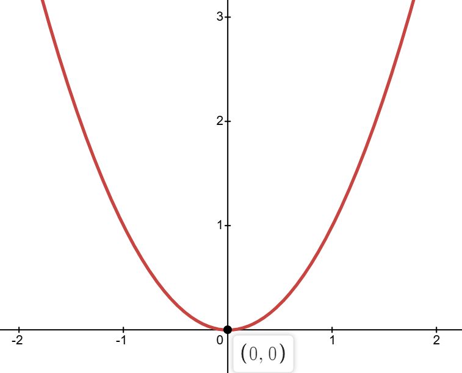
$x^3$ 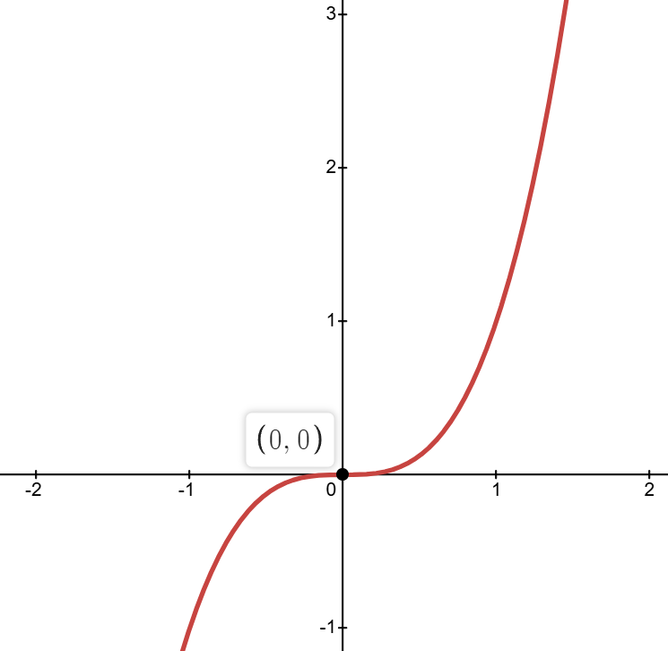
$2x - x^2$ 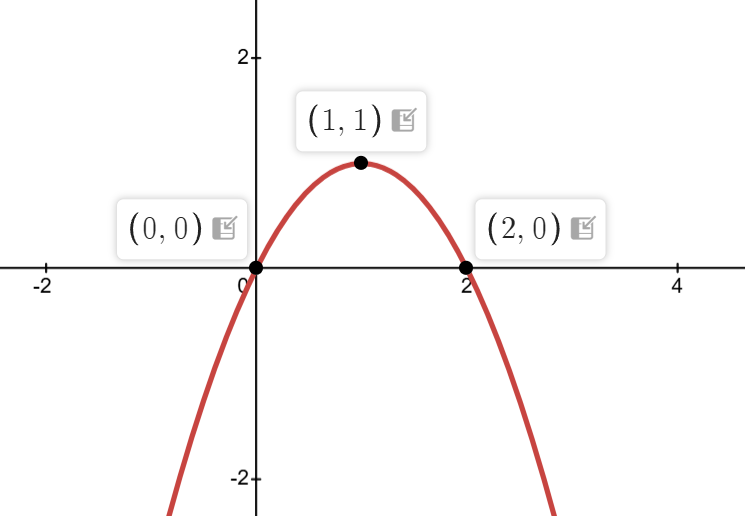
$e^x$ 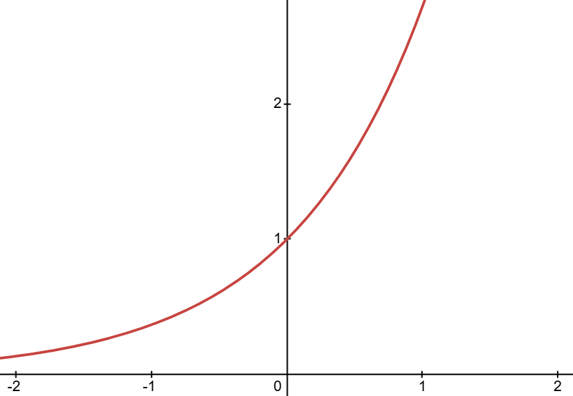
$e^{-x}$ 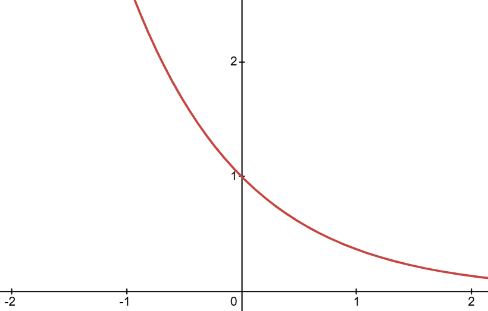
$sin(x)$ 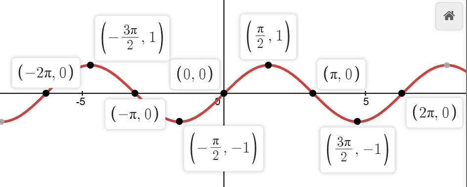
$cos(x)$ 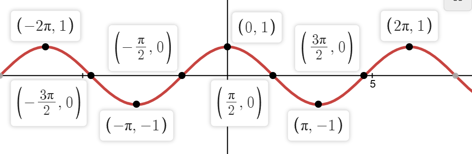
$tan(x)$ 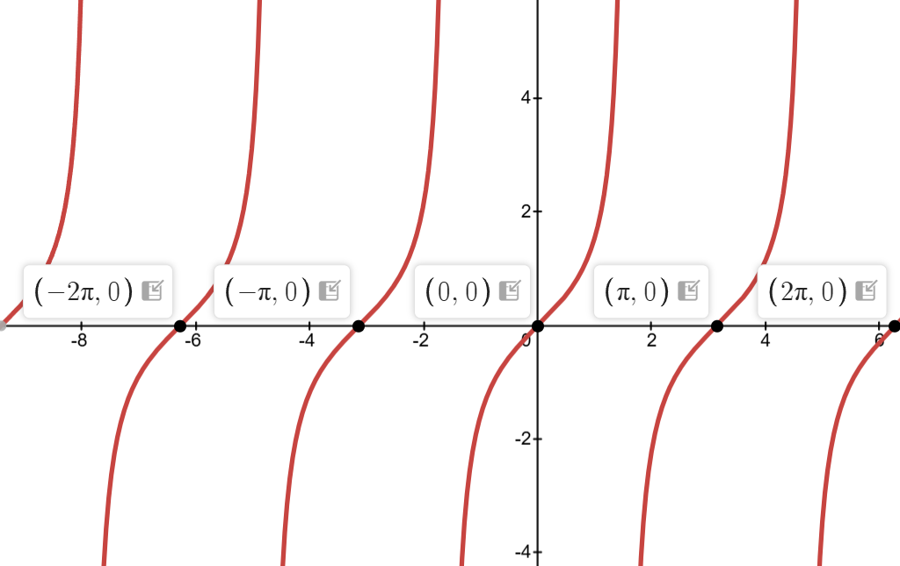
单位圆 (sin对应y轴，cos对应x轴) 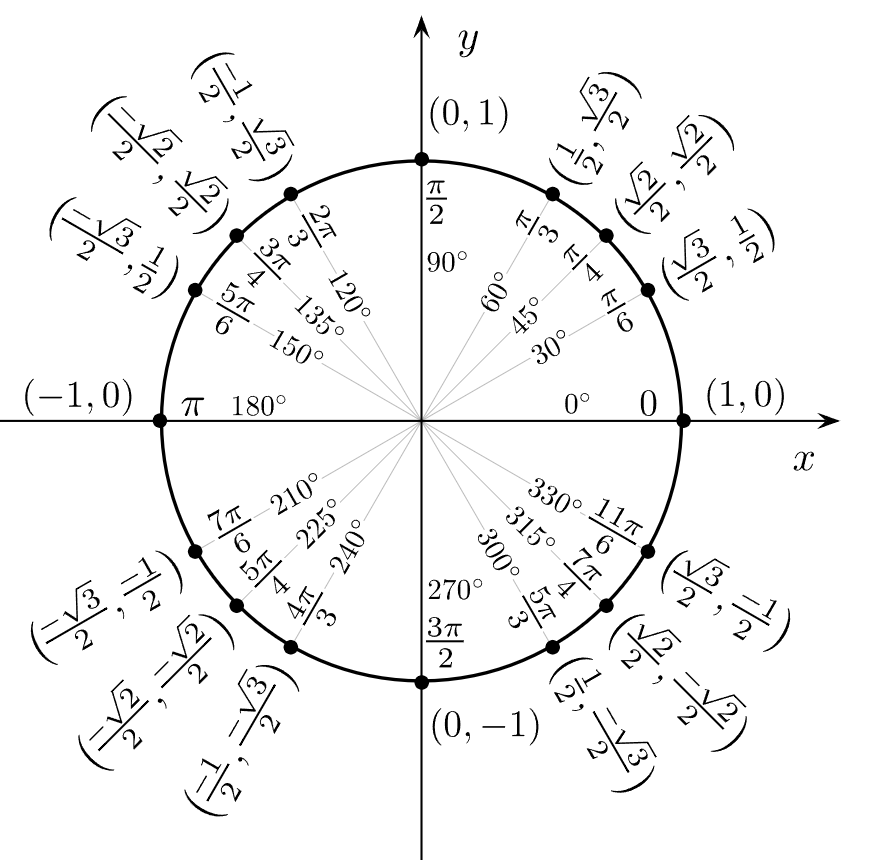
三角恒等式 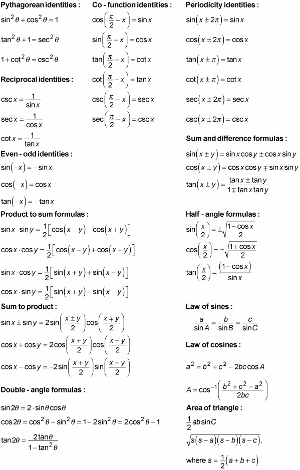
导数与积分表 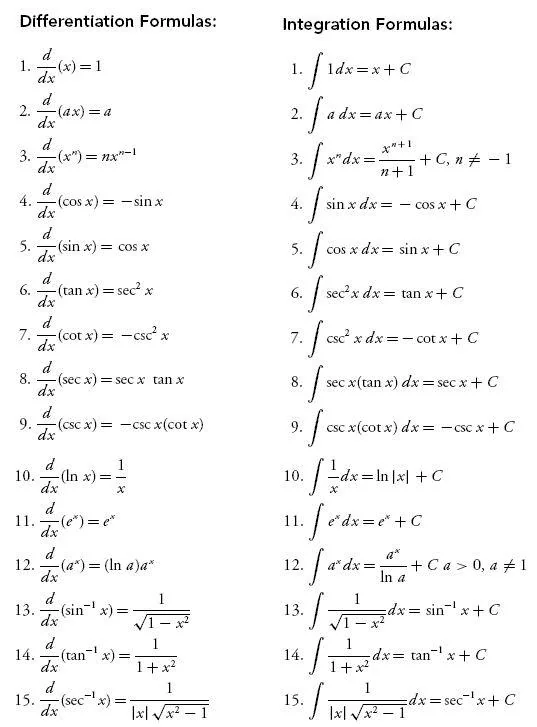

## 参考文献
图片出处: 
Strogatz, Steven H.. Nonlinear Dynamics and Chaos : With Applications to Physics, Biology, Chemistry, and Engineering, Westview Press, 2014. ProQuest Ebook Central, http://ebookcentral.proquest.com/lib/washington/detail.action?docID=1181622.

单位圆出处: Wikipedia

资料出处:
University of Washington Course AMATH 402, taught by Professor Anastassiya Semenova