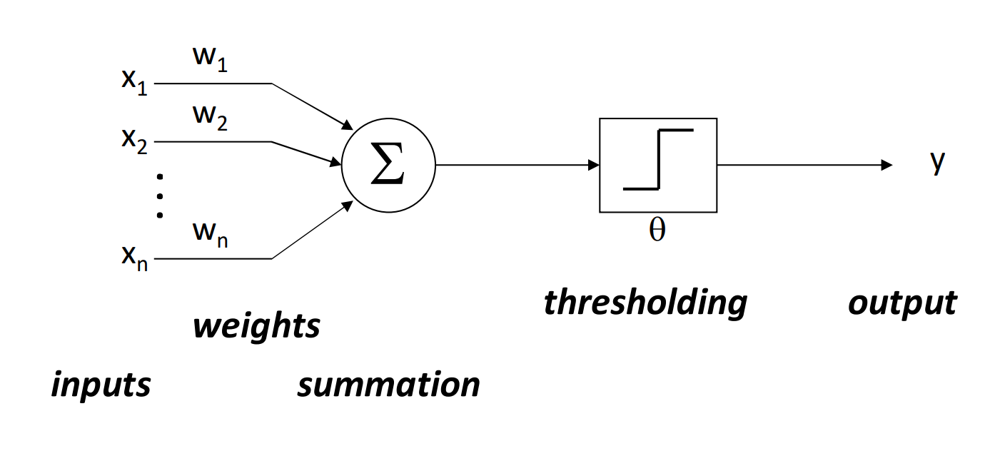

# Preceptrons (Neural Networks)
2025-03-05

## Convergence
Perceptron training always converges if the training data y_1 and y_2 are linearly
separable sets.

## Reinforcent Learning
Weights update when prediction able is incorrect.

Prediction: $\hat{y} = sign(w \cdot x)$

## Weight Update Equation

$w \leftarrow w + \alpha y x$

Where:

- $x$ is feature value array
- $y$ is correctly label
- $\alpha$ is learning rate

## Multiclass Perceptrons
- An extension of the perceptron algorithm that can classify inputs into more than two classes, bu having multiple weight vectors.

### Weight Updates Rule

Weight Vector of class: $w_y$

Score (activation) of class y: $w_y \cdot f(x)$

$y = arg max_y w_y f(x)$

If correct: No change

If wrong:

Correct $w_y$ = $w_y$ + f(x)

Wrong $w_y$ = $w_y$ - f(x)